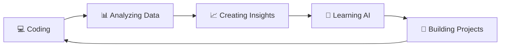

<div align="center">


<a href="https://www.linkedin.com/in/soumo-sarkar-a72496372/"></a>
<a href="mailto:soumo0155@gmail.com"></a>
<a href="https://www.instagram.com/soum077/"></a>

<br/>


<br/><br/>

<!-- Animated snake eating the contribution graph -->


<br/>

<!-- Rotating quote of the day -->


</div>

<br/>

## 👨‍💻 About Me


```python
class Soumojit:
    def __init__(self):
        self.name = "Soumojit Sarkar"
        self.role = "Data Analyst | Python Developer"
        self.location = "India 🇮🇳"
        self.focus = ["Data Analytics", "Artificial Intelligence"]
        self.currently_learning = ["Scikit-learn", "XGBoost", "TensorFlow", "Advanced SQL", "Power BI"]
        self.fun_fact = "I turn messy spreadsheets into stories worth telling"

    def say_hi(self):
        print("Thanks for stopping by — let's build something with data! 🚀")

me = Soumojit()
me.say_hi()
```

- 🔭 **Currently working on:** Real-world analytics & dashboard projects
- 📊 **Focus:** Data Analytics & Artificial Intelligence
- 🐍 **Programming:** Python
- 🗄️ **Database:** SQL / MySQL
- 📈 **Visualization:** Power BI & Matplotlib
- 📊 **Data Tools:** Pandas & NumPy
- 🌱 **Currently Learning:** Advanced SQL, Power BI & Machine Learning
- 🎯 **Goal:** Become a professional AI/ML Engineer
- ⚡ **Fun fact:** I turn messy spreadsheets into stories worth telling

<br clear="right"/>

---

## 💻 Tech Stack

<div align="center">


<br/><br/>


</div>

---

## 🚀 Featured Projects

<table>
<tr>
<td width="50%" valign="top">

### 📦 Supply Chain Dashboard
📊 Interactive dashboard analyzing supply chain performance, sales, and logistics KPIs.

`Excel` `Power BI` `Data Analysis`

</td>
<td width="50%" valign="top">

### 🍽️ Zomato Restaurant Analysis
📈 Exploratory data analysis exploring restaurant trends, ratings, and business insights.

`Python` `Pandas` `NumPy` `Matplotlib`

</td>
</tr>
<tr>
<td width="50%" valign="top">

### ⚽ FIFA World Cup 2026 Project
🌍 Data analysis & visualization of teams, matches, players, and tournament statistics.

`Python` `Pandas` `NumPy` `Matplotlib` `Power BI`

</td>
<td width="50%" valign="top">

### ✨ More Coming Soon
🛠️ New analytics and ML projects are always in the pipeline — stay tuned!

`Python` `Machine Learning` `SQL`

</td>
</tr>
</table>

---

## 🌱 Currently Learning — AI / ML Track

<div align="center">


<br/><br/>


<br/><br/>

</div>

| Category | Skills / Models |
|---|---|
| 🧮 **Core Libraries** | `NumPy` `Pandas` `Matplotlib` `Seaborn` |
| 🤖 **ML Framework** | `Scikit-learn` `XGBoost` |
| 📐 **Regression Models** | Linear Regression, Ridge, Lasso, Polynomial Regression |
| 🌳 **Tree-Based Models** | Decision Tree, Random Forest, Gradient Boosting, XGBoost |
| 🧠 **Classification** | Logistic Regression, KNN, SVM, Naive Bayes |
| 🧩 **Clustering** | K-Means, Hierarchical Clustering |
| 🛠️ **Model Workflow** | Feature Engineering, Train/Test Split, Cross-Validation, Hyperparameter Tuning (GridSearchCV) |
| 📊 **Evaluation** | Accuracy, Precision/Recall, F1-Score, RMSE, R², Confusion Matrix |
| 🗄️ **Foundations** | Advanced SQL • Power BI • Data Visualization |

<div align="center">

`Advanced SQL` • `Power BI` • `Data Visualization` • `Machine Learning` • `Deep Learning (Intro)` • `Artificial Intelligence`

</div>

---

## 📊 GitHub Statistics

<div align="center">


<br/>


<br/>


<br/>


</div>

---

## 🏆 GitHub Achievements

<div align="center">


</div>

---

## 🧊 3D Contribution Calendar

<div align="center">


<sub>⚙️ Generated automatically via GitHub Actions — see setup note at the bottom</sub>

</div>

---

## 📈 Detailed Metrics

<div align="center">


</div>

---

## 📌 My Journey

<div align="center">



</div>

---

<div align="center">


<br/><br/>

<a href="https://www.buymeacoffee.com/soumojit"></a>


</div>

<!--
SETUP NOTES (delete this comment block once done — GitHub won't render it anyway):

1. Snake contribution graph (animated + 3D) needs a one-time GitHub Action in this repo:
   https://github.com/Platane/snk#-getting-started  → gives you the "grid-snake-dark.svg" workflow
   https://github.com/yoshi389111/github-profile-3d-contrib → gives you the "grid-snake-3d.svg" workflow
   Without these two Actions set up, those two images will show as broken.

2. "Buy me a coffee" badge points to buymeacoffee.com/soumojit — update the URL if that's not your real handle, or delete the badge if you don't want it.

3. Everything else (typing SVG, stats, trophies, quote card, metrics) works automatically off your GitHub username, no setup needed.
-->
