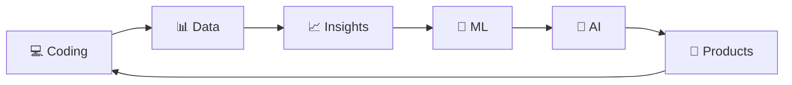

<div align="center">


<br/>

<a href="https://www.linkedin.com/in/soumo-sarkar-a72496372/">

</a>

<a href="mailto:soumo0155@gmail.com">

</a>

<a href="https://www.instagram.com/soum077/">

</a>

<a href="https://github.com/Soumo444">

</a>

<br/><br/>


</div>

---

<div align="center">

## 💭 Entrepreneur Mindset


<br/>

### 🚀 Build. Learn. Fail. Improve. Repeat.

</div>

---

## 👨‍💻 About Me


```python
class Soumojit:

    def __init__(self):

        self.name = "Soumojit Sarkar"
        self.role = "Data Analyst | Python Developer"
        self.location = "India 🇮🇳"

        self.focus = [
            "Data Analytics",
            "Artificial Intelligence",
            "Machine Learning",
            "Business Intelligence"
        ]

        self.learning = [
            "Advanced SQL",
            "Machine Learning",
            "Scikit-learn",
            "XGBoost",
            "Power BI"
        ]

        self.mindset = "Learn. Build. Improve. 🚀"

    def introduce(self):
        return "Turning data into meaningful insights."

    def future_goal(self):
        return "Become a professional AI/ML Engineer."


me = Soumojit()

print(me.introduce())
print(me.future_goal())
```

### 🔭 Currently Working On

* 📊 Real-world **Data Analytics projects**
* 🐍 Python-based applications
* 📈 Interactive Power BI dashboards
* 🗄️ SQL & MySQL data projects
* 🤖 Machine Learning projects
* 🧠 Exploring Artificial Intelligence

### 🎯 My Mission

> **Turn data into decisions, ideas into products, and learning into impact.**

<br clear="right"/>

---

# ⚡ Tech Stack

<div align="center">

### 💻 Development


<br/><br/>

### 📊 Data & Analytics


<br/><br/>

### 🤖 AI / Machine Learning


<br/><br/>


</div>

---

# 🧠 What I'm Learning

<div align="center">

```text
                    ┌──────────────────┐
                    │   DATA ANALYTICS │
                    └────────┬─────────┘
                             │
                             ▼
                    ┌──────────────────┐
                    │      PYTHON     │
                    └────────┬─────────┘
                             │
                             ▼
                    ┌──────────────────┐
                    │  MACHINE        │
                    │  LEARNING       │
                    └────────┬─────────┘
                             │
                             ▼
                    ┌──────────────────┐
                    │  ARTIFICIAL      │
                    │  INTELLIGENCE    │
                    └────────┬─────────┘
                             │
                             ▼
                    ┌──────────────────┐
                    │   AI ENGINEER    │
                    └──────────────────┘
```

</div>

| 🧩 Area          | 🚀 Skills                                    |
| ---------------- | -------------------------------------------- |
| 🐍 Programming   | Python                                       |
| 🗄️ Database     | SQL • MySQL                                  |
| 📊 Analytics     | Pandas • NumPy                               |
| 📈 Visualization | Power BI • Matplotlib • Excel                |
| 🤖 ML            | Scikit-learn • XGBoost                       |
| 🧠 AI            | Machine Learning • AI Applications           |
| 🛠️ Workflow     | EDA • Feature Engineering • Model Evaluation |

---

# 📚 Machine Learning Knowledge

<div align="center">

`Linear Regression`
`Logistic Regression`
`Decision Tree`
`Random Forest`
`Gradient Boosting`
`XGBoost`
`KNN`
`SVM`
`Naive Bayes`
`K-Means`

</div>

### 🔬 ML Workflow

```text
Data Collection
      ↓
Data Cleaning
      ↓
Exploratory Data Analysis
      ↓
Feature Engineering
      ↓
Model Training
      ↓
Model Evaluation
      ↓
Hyperparameter Tuning
      ↓
Deployment
      ↓
🚀 Real-World AI Application
```

---

# 📊 GitHub Statistics

<div align="center">


<br/><br/>


</div>

---

# 🐍 Contribution Activity

<div align="center">


</div>

---

# 🏆 GitHub Achievements

<div align="center">


</div>

---

# 📈 My Growth Journey

<div align="center">



</div>

---

# 🎯 2026 Goals

<div align="center">

| Status | Goal                               |
| ------ | ---------------------------------- |
| 🟢     | Strengthen Python                  |
| 🟢     | Master SQL                         |
| 🟢     | Build Data Analytics Projects      |
| 🟢     | Create Power BI Dashboards         |
| 🟡     | Master Machine Learning            |
| 🟡     | Learn Advanced Feature Engineering |
| 🟡     | Build ML APIs                      |
| 🔵     | Explore Deep Learning              |
| 🔵     | Build AI Applications              |
| 🔵     | Contribute to Open Source          |

</div>

---

# 💡 My Philosophy

<div align="center">

### `"Don't just learn technology. Build with it."`

<br>

### 💻 Learn

### ↓

### 🛠️ Build

### ↓

### 🐛 Fail

### ↓

### 🔧 Debug

### ↓

### 📈 Improve

### ↓

### 🚀 Repeat

</div>

---

# 🌐 Connect With Me

<div align="center">

<a href="https://www.linkedin.com/in/soumo-sarkar-a72496372/">

</a>

<a href="mailto:soumo0155@gmail.com">

</a>

<a href="https://www.instagram.com/soum077/">

</a>

<br/><br/>

### ⭐ If you like my work, consider giving my repositories a star!

</div>

---

<div align="center">


<br/><br/>


</div>

<!--
SNAKE SETUP:

The snake image requires a GitHub Action to generate your contribution animation.

After configuring the action, this URL should work:

https://raw.githubusercontent.com/Soumo444/Soumo444/output/github-contribution-grid-snake-dark.svg

Make sure your repository is named:

Soumo444/Soumo444

-->
