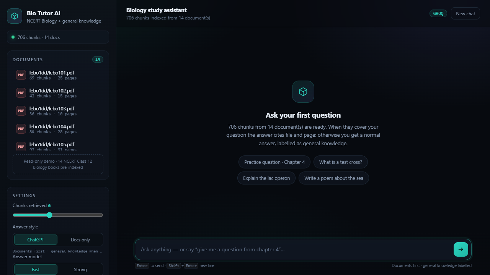
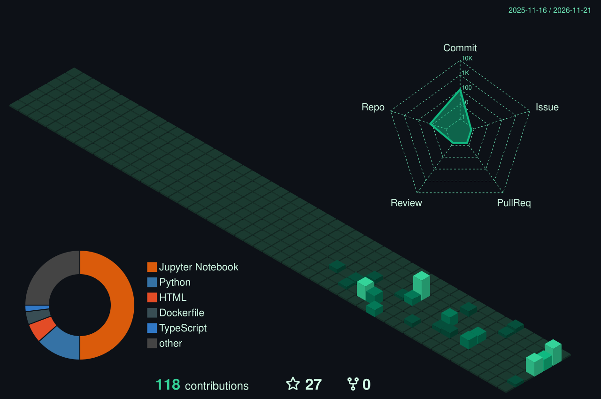

<div align="center">


<a href="https://github.com/Soumo444">

</a>

<br/>


<br/><br/>

[**About**](#about) &nbsp;·&nbsp; [**Building**](#what-im-building) &nbsp;·&nbsp; [**Projects**](#more-projects) &nbsp;·&nbsp; [**Stack**](#stack) &nbsp;·&nbsp; [**Activity**](#github-activity) &nbsp;·&nbsp; [**Connect**](#lets-connect)

</div>


## About

I'm a **data scientist and analyst** from Kolkata, India. I started in analytics — SQL, dashboards, business KPIs — and grew into the full pipeline: clean the data, find the signal, train the model, then **ship it as something people can actually use**.

I care about work that runs in production, not notebooks that only run once. That's taken me from churn models and Power BI dashboards into **RAG systems, LLM apps, and developer tooling**.

```python
class Soumojit:
    role      = "Data Scientist / Analyst"
    location  = "Kolkata, India"
    focus     = ["Machine Learning", "GenAI & RAG", "Business Analytics"]
    shipping  = ["Python", "FastAPI", "Streamlit", "Docker", "AWS"]
    open_to   = "Data Science · ML · Analytics roles"

    def philosophy(self) -> str:
        return "Understand the business → clean the data → model it → explain it → ship it."
```

<table align="center">
<tr>
<td align="center" width="25%">

## 11

<sub>PROJECTS BUILT</sub>

</td>
<td align="center" width="25%">

## 5

<sub>LIVE DEMOS</sub>

</td>
<td align="center" width="25%">

## 97.4%

<sub>BEST MODEL ACCURACY</sub>

</td>
<td align="center" width="25%">

## 706

<sub>RAG CHUNKS INDEXED</sub>

</td>
</tr>
</table>


## What I'm Building

### 🧬 [NCERT Bio Tutor](https://github.com/Soumo444/ncert-bio-tutor) — RAG that cites the textbook

[](https://ncert-bio-tutor.onrender.com)
[](https://github.com/Soumo444/ncert-bio-tutor)

A free study assistant for **NCERT Class 12 Biology**. It retrieves from **706 indexed chunks across 14 textbook PDFs**, then answers with the **chapter and page cited** — plus practice questions, chapter quizzes, and grading of written answers.

`FastAPI` · `ChromaDB` · `Groq` · `Gemini` · `Docker`

<a href="https://ncert-bio-tutor.onrender.com">

</a>

<sub>Free-tier hosting — the first request may take up to a minute to wake.</sub>

<br/>

<table>
<tr>
<td width="50%" valign="top">

### 🧠 [ctx-gen](https://github.com/Soumo444/ctx-gen)

A CLI that scans your project and writes a token-optimized `project-context.md` for Cursor, Copilot, and Claude.

**Published on npm** · MIT licensed

`TypeScript` `Node.js` `CLI`

[**npm package →**](https://www.npmjs.com/package/@soumo444/ctx-gen) &nbsp;·&nbsp; [**Source →**](https://github.com/Soumo444/ctx-gen)

</td>
<td width="50%" valign="top">

### 🎙️ [AI Meeting Assistant](https://github.com/Soumo444/ai-meeting-assistant)

Turns any meeting recording into an executive summary, key decisions, action items, and sentiment.

**Whisper large-v3 + GPT-OSS 120B** on Groq

`Python` `Groq` `Whisper` `LLM`

[**Live app →**](https://ai-meeting-assistant-byz2.onrender.com) &nbsp;·&nbsp; [**Source →**](https://github.com/Soumo444/ai-meeting-assistant)

</td>
</tr>
<tr>
<td width="50%" valign="top">

### 📉 [Customer Churn Intelligence](https://github.com/Soumo444/Customer-Churn-Business-Analysis)

End-to-end churn analysis: SQL KPIs, root-cause analysis, XGBoost/Random Forest, Power BI, and a Streamlit app.

**90% accuracy** · **0.86 ROC-AUC**

`Python` `SQL` `Scikit-Learn` `Power BI`

[**Live app →**](https://customer-churn-business-analysis-vtb7gvwpkvhdrtjpddnz62.streamlit.app/) &nbsp;·&nbsp; [**Source →**](https://github.com/Soumo444/Customer-Churn-Business-Analysis)

</td>
<td width="50%" valign="top">

### ✈️ [Flight Price Prediction](https://github.com/Soumo444/Flight-price-prediction)

An XGBoost fare estimator with an animated route explorer and a 69-feature input inspector.

**MAE ₹2,553.91** · **R² 0.9509**

`Python` `XGBoost` `Streamlit`

[**Live app →**](https://flight-price-prediction-444.streamlit.app/) &nbsp;·&nbsp; [**Source →**](https://github.com/Soumo444/Flight-price-prediction)

</td>
</tr>
</table>


## More Projects

<table>
<tr>
<td width="50%" valign="top">

**🛡️ [Spam Email Detector](https://github.com/Soumo444/Spam_Email_Detector)**  
TF-IDF + Multinomial Naive Bayes served through FastAPI. **97.4% accuracy**, deployed and testable in the browser.  
`Python` `FastAPI` `scikit-learn` — [**Live API →**](https://spam-email-detector-vfib.onrender.com/docs)

</td>
<td width="50%" valign="top">

**☁️ [ml_project](https://github.com/Soumo444/ml_project)**  
End-to-end regression pipeline with automated deploys: CodePipeline → Elastic Beanstalk, plus an EC2 container served from ECR.  
`Python` `AWS` `Docker` `CI/CD`

</td>
</tr>
<tr>
<td width="50%" valign="top">

**🚚 [DataCo Supply Chain Analytics](https://github.com/Soumo444/DataCo-Supply-Chain-Analytics)**  
**180K+ orders** analyzed to find the root causes of late delivery and map profitability across markets, regions, and segments.  
`Python` `MySQL` `Power BI`

</td>
<td width="50%" valign="top">

**🛒 [E-commerce Sales Analytics](https://github.com/Soumo444/ecommerce-sales-analytics)**  
**54.38K+ transactions** and **$158M net revenue** modeled in SQL and turned into an interactive Power BI dashboard.  
`Python` `SQL` `Power BI`

</td>
</tr>
<tr>
<td width="50%" valign="top">

**🍽️ [Zomato Bangalore Analysis](https://github.com/Soumo444/Zomato_Bangalore_Project)**  
**50,000+ restaurants** analyzed for ratings, pricing, location, and online-ordering patterns.  
`Python` `SQL` `Excel` `Power BI`

</td>
<td width="50%" valign="top">

**🌍 [FIFA World Cup 2026 Analysis](https://github.com/Soumo444/world-26-data-analysis)**  
Player, team, position, passing, attacking, defensive, and market-value analysis of the tournament.  
`Python` `Pandas` `Visualization`

</td>
</tr>
</table>


## Stack

**Languages & Data**


**Machine Learning & AI**


**BI & Analytics**


**Cloud & Tooling**


## GitHub Activity

<div align="center">


<br/>


<br/>



<br/>

<sub>3D contribution graph · rebuilt every night</sub>

</div>


## Focus for 2026

- **Ship more production AI** — RAG systems with real evaluation, not just demos.
- **Go deeper on MLOps** — reproducible training, containerized deploys, and CI/CD on AWS.
- **Keep the analytics edge** — the SQL and business storytelling that make models usable.


## Let's Connect

<div align="center">

I'm open to **data science, machine learning, and analytics** roles — and always happy to talk about data, RAG, or shipping side projects.

[](https://www.linkedin.com/in/soumojit444/) &nbsp; [](mailto:soumo0155@gmail.com) &nbsp; [](https://github.com/Soumo444)

<sub>Data → Insight → Intelligence</sub>

</div>


